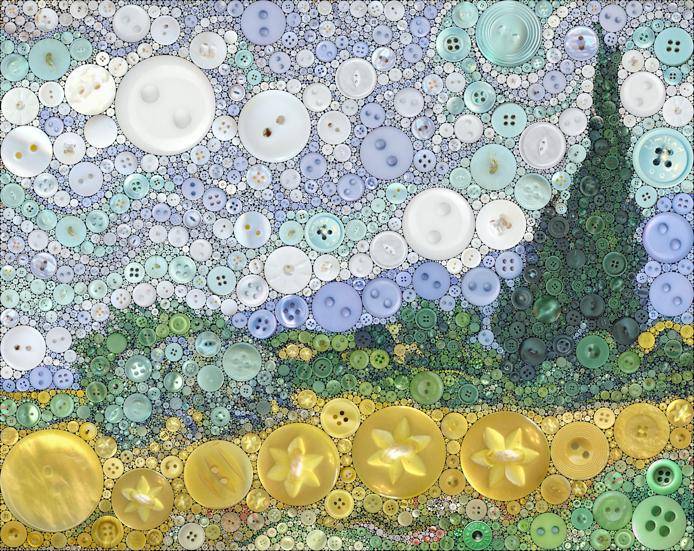
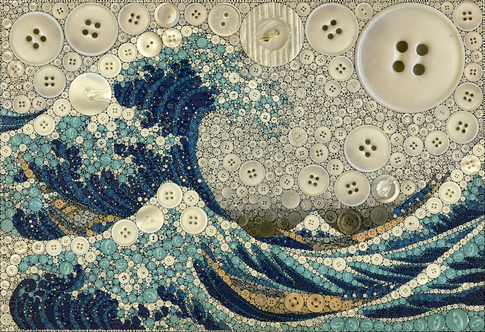
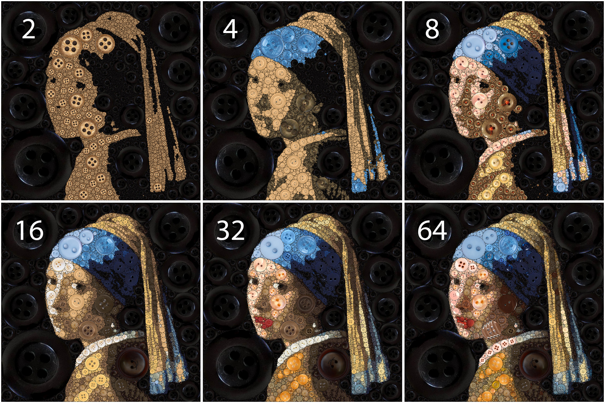
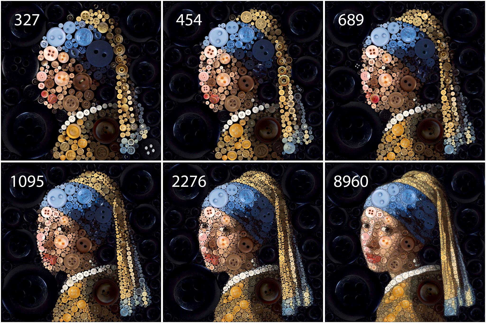

# Button Mosaic

### Wheat Field with Cypresses - *Vincent van Gogh*

<div about="results/wheat-field-with-cypresses-button-mosaic.jpg">
	
	<a rel="license" href="https://creativecommons.org/licenses/by-nc-sa/4.0/"></a>
</div>

### The Great Wave off Kanagawa - *Hokusai*

<div about="results/great-wave-off-kanagawa-button-mosaic.jpg">
  
  <a rel="license" href="https://creativecommons.org/licenses/by-nc-sa/4.0/"></a>
</div>

### [More Results](https://linusmossberg.github.io/button-mosaic/results/)

## Report

A report describing this work in more detail is available [here](report.pdf). 

## Usage

Set the MATLAB working directory to the *source* directory to use the program. The simplest use is then:
```
[mosaic, corrected] = buttonMosaic(image);
```
where the input *image* is the RGB-image that should be reproduced and the outputs *mosaic* and *corrected* are the resulting mosaics with and without color correction. For more advanced use, see [source/examples.m](source/examples.m) and [settings](#settings).

## Settings

The program settings consists of two structs, *circle_packing_settings* and *mosaic_settings*.

<details>
<summary>circle_packing_settings</summary><br/>

| Field                  | Explanation                                                                                                                                                        |
|------------------------|--------------------------------------------------------------------------------------------------------------------------------------------------------------------|
| min_radius             | [Minimum Radius](#minimum-radius)                                                                                                                                  |
| num_clusters           | Number of perceptually distinct color regions that the image should be segmented to. The image segments are used to determine the size and position of circles.    |
| max_radius             | Maximum circle radius.                                                                                                                                             |
| radius_reduction_start | Radius where circle radii will start being asymptotically reduced towards max_radius.                                                                              |
| smooth_est_scale       | Image crop factor when estimating settings for the anisotropic diffusion image smoothing. Large images has to be cropped to complete this step in reasonable time. |
| label_close_radius     | Radius of circular structuring element used for pre-filtering the segmented image using morphological close.                                                       |
| label_min_area         | Regions or holes below this area are removed from the segmented image in the pre-filtering step.                                                                   |

</details>

<details>
<summary>mosaic_settings</summary><br/>

| Field                | Explanation                                                                                                                                                                                       |
|----------------------|---------------------------------------------------------------------------------------------------------------------------------------------------------------------------------------------------|
| scale                | Scale factor for the mosaic. If the input is 256x512 and *scale* is 2, then the resulting mosaic will be 512x1024.                                                                                |
| AA                   | Anti-Aliasing supersampling factor. The mosaic is scaled by this factor and then downsampled by the same factor to reduce aliasing.                                                               |
| button_history       | The size of the buffer that keeps track of previously used buttons.                                                                                                                               |
| similarity_threshold | The program picks the best button match not contained in the button history if it is within this similarity threshold compared to the best button match. This can be used to increase button variety. |
| min_dominant_radius  | Circle radii above or equal to this uses dominant color matching to match buttons. Mean color matching is used for radii smaller than this.                                                       |
| unique_button_limit  | [Unique Button Limit](#unique-button-limit)                                                                                                                                                       |

</details>

### Unique Button Limit
The program has a setting to control the number of unique buttons used in the reproduction, *mosaic_settings.unique_button_limit*. The program picks the most perceptually important buttons needed to reproduce the given reference image using K-means in CIELAB space, similar to Lloyd-Max quantization using the LBG-algorithm.

<div about="results/unique-reduction.jpg">
  
  <a rel="license" href="https://creativecommons.org/licenses/by-nc-sa/4.0/"></a>
</div>
<p align="center"><i>Images reproduced with different numbers of unique buttons.</i></p>

### Minimum Radius
The number of total buttons used in the reproduction can also be controlled by changing the minimum circle radius, *circle_packing_settings.min_radius*. The number of total buttons increases quadratically with decreasing minimum radius.

<div about="results/total-reduction.jpg">
  
  <a rel="license" href="https://creativecommons.org/licenses/by-nc-sa/4.0/"></a>
</div>
<p align="center"><i>Images reproduced with different numbers of total buttons.</i></p>

---

<div about="results/circle-packing.gif">
  
  <a rel="license" href="https://creativecommons.org/licenses/by/4.0/"></a>
</div>
<p align="center"><i>Circle packing with mimimum radius decreasing one pixel each frame.</i></p>

## Requirements

The following products are required to run the program:

| Name                                    | Version      |
| --------------------------------------- | ------------ |
| Matlab                                  | R2019b (9.7) |
| Image Processing Toolbox                | 11.0         |
| Statistics and Machine Learning Toolbox | 11.6         |

## License and Attributions

I've created the database of buttons by splitting, cropping, masking and resizing images of buttons sourced from various places. All source images are licensed to permit sharing and adaption and I've attributed the creators of these images under *attributions* below.

<details><summary>Attributions</summary>
<br/>
<p>I've sourced the images of buttons from the following creators:</p>

<pre>
Creator: <a href="https://www.flickr.com/people/93410621@N05">https://www.flickr.com/people/93410621@N05</a>
License: <a href="https://creativecommons.org/licenses/by-nc-sa/2.0/">https://creativecommons.org/licenses/by-nc-sa/2.0/</a>
</pre>
<pre> 
Creator: <a href="https://www.flickr.com/people/106074308@N06/">https://www.flickr.com/people/106074308@N06/</a>
License: <a href="https://creativecommons.org/licenses/by/2.0/">https://creativecommons.org/licenses/by/2.0/</a>
</pre>
<pre> 
Creator: <a href="https://www.flickr.com/people/volvob12b/">https://www.flickr.com/people/volvob12b/</a>
License: <a href="https://creativecommons.org/publicdomain/zero/1.0/">https://creativecommons.org/publicdomain/zero/1.0/</a>
</pre>
<pre> 
Creator: <a href="https://www.flickr.com/people/twenty_questions">https://www.flickr.com/people/twenty_questions</a>
License: <a href="https://creativecommons.org/licenses/by-nc/2.0/">https://creativecommons.org/licenses/by-nc/2.0/</a>
</pre>
<pre> 
Creator: <a href="https://www.flickr.com/people/markmorgantrinidad">https://www.flickr.com/people/markmorgantrinidad</a>
License: <a href="https://creativecommons.org/licenses/by/2.0/">https://creativecommons.org/licenses/by/2.0/</a>
</pre>
<pre> 
Creator: <a href="https://www.flickr.com/people/presley_m/">https://www.flickr.com/people/presley_m/</a>
License: <a href="https://creativecommons.org/licenses/by-nc-sa/2.0/">https://creativecommons.org/licenses/by-nc-sa/2.0/</a>
</pre>
<pre> 
Creator: <a href="https://www.flickr.com/people/130331218@N03/">https://www.flickr.com/people/130331218@N03/</a>
License: <a href="https://creativecommons.org/licenses/by-nc-sa/2.0/">https://creativecommons.org/licenses/by-nc-sa/2.0/</a>
</pre>
<pre> 
Creator: <a href="https://www.flickr.com/people/mag3737/">https://www.flickr.com/people/mag3737/</a>
License: <a href="https://creativecommons.org/licenses/by-nc-sa/2.0/">https://creativecommons.org/licenses/by-nc-sa/2.0/</a>
</pre>
<pre> 
Creator: <a href="https://www.flickr.com/people/deanhochman/">https://www.flickr.com/people/deanhochman/</a>
License: <a href="https://creativecommons.org/licenses/by/2.0/">https://creativecommons.org/licenses/by/2.0/</a>
</pre>
<pre> 
Creator: <a href="https://www.flickr.com/people/littlelixie/">https://www.flickr.com/people/littlelixie/</a>
License: <a href="https://creativecommons.org/licenses/by-nc/2.0/">https://creativecommons.org/licenses/by-nc/2.0/</a>
</pre>
<pre> 
Creator: <a href="https://www.flickr.com/people/obd-design">https://www.flickr.com/people/obd-design</a>
License: <a href="https://creativecommons.org/licenses/by-nc-sa/2.0/">https://creativecommons.org/licenses/by-nc-sa/2.0/</a>
</pre>
<pre> 
Creator: <a href="https://www.pexels.com/">https://www.pexels.com/</a>
License: <a href="https://creativecommons.org/publicdomain/zero/1.0/">https://creativecommons.org/publicdomain/zero/1.0/</a>
</pre>
<pre> 
Creator: <a href="https://pikrepo.com/">https://pikrepo.com/</a>
License: <a href="https://creativecommons.org/publicdomain/zero/1.0/">https://creativecommons.org/publicdomain/zero/1.0/</a>
</pre>
<pre> 
Creator: <a href="https://pixabay.com/">https://pixabay.com/</a>
License: <a href="https://creativecommons.org/publicdomain/zero/1.0/">https://creativecommons.org/publicdomain/zero/1.0/</a>
</pre>
<pre> 
Creator: <a href="https://pixbay.com/">https://pixbay.com/</a>
License: <a href="https://creativecommons.org/publicdomain/zero/1.0/">https://creativecommons.org/publicdomain/zero/1.0/</a>
</pre>
<pre> 
Creator: <a href="https://pixnio.com/">https://pixnio.com/</a>
License: <a href="https://creativecommons.org/publicdomain/zero/1.0/">https://creativecommons.org/publicdomain/zero/1.0/</a>
</pre>
<pre> 
Creator: <a href="http://www.readyelements.com/">http://www.readyelements.com/</a>
License: <a href="https://creativecommons.org/publicdomain/zero/1.0/">https://creativecommons.org/publicdomain/zero/1.0/</a>
</pre>
<pre> 
Creator: <a href="https://www.flickr.com/people/salvagenation">https://www.flickr.com/people/salvagenation</a>
License: <a href="https://creativecommons.org/licenses/by-nc-sa/2.0/">https://creativecommons.org/licenses/by-nc-sa/2.0/</a>
</pre>
<pre> 
Creator: <a href="https://www.flickr.com/people/14903992@N08">https://www.flickr.com/people/14903992@N08</a>
License: <a href="https://creativecommons.org/licenses/by-nc/2.0/">https://creativecommons.org/licenses/by-nc/2.0/</a>
</pre>
<pre> 
Creator: <a href="https://www.flickr.com/people/shellysblogger/">https://www.flickr.com/people/shellysblogger/</a>
License: <a href="https://creativecommons.org/licenses/by-nc-sa/2.0/">https://creativecommons.org/licenses/by-nc-sa/2.0/</a>
</pre>
<pre> 
Creator: <a href="https://www.flickr.com/people/thevintagesailor/">https://www.flickr.com/people/thevintagesailor/</a>
License: <a href="https://creativecommons.org/licenses/by-nc/2.0/">https://creativecommons.org/licenses/by-nc/2.0/</a>
</pre>
<pre> 
Creator: <a href="https://www.flickr.com/people/23882161@N03/">https://www.flickr.com/people/23882161@N03/</a>
License: <a href="https://creativecommons.org/licenses/by-nc/2.0/">https://creativecommons.org/licenses/by-nc/2.0/</a>
</pre>
<pre> 
Creator: <a href="https://www.flickr.com/people/welshkaren">https://www.flickr.com/people/welshkaren</a>
License: <a href="https://creativecommons.org/licenses/by-nc/2.0/">https://creativecommons.org/licenses/by-nc/2.0/</a>
</pre>
<pre> 
Creator: <a href="https://www.flickr.com/people/30478819@N08/">https://www.flickr.com/people/30478819@N08/</a>
License: <a href="https://creativecommons.org/licenses/by/2.0/">https://creativecommons.org/licenses/by/2.0/</a>
</pre>
</details>

___

The reproduced paintings and photos are all in the public domain, but some of the source images of buttons are licensed under the share-alike license CC BY-NC-SA 2.0. The reproduced images are therefore licensed under:

<https://creativecommons.org/licenses/by-nc-sa/4.0/>

I've bumped the license to the latest 4.0 version since these are [compatible](https://creativecommons.org/share-your-work/licensing-considerations/compatible-licenses/) and because this is suggested by CC.