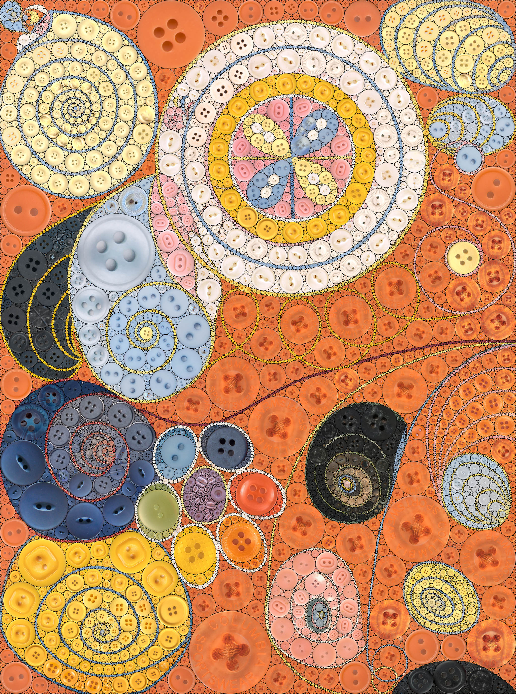
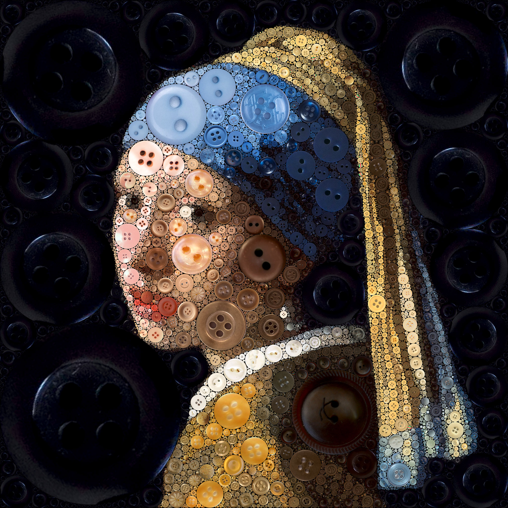
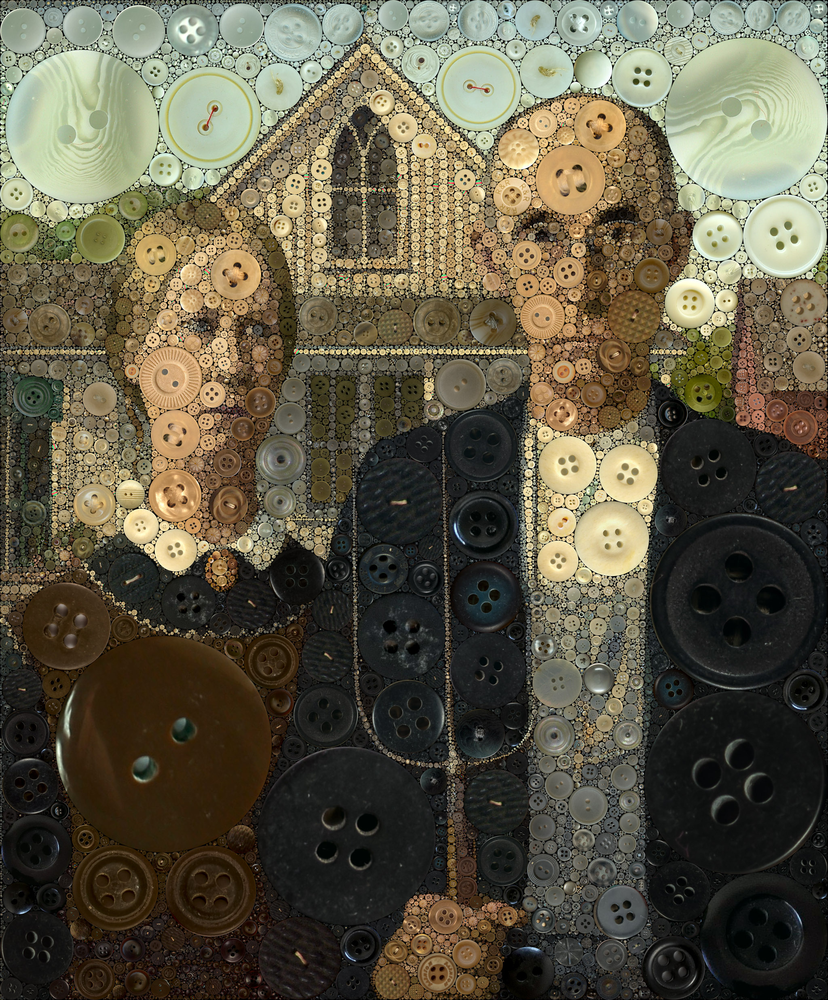
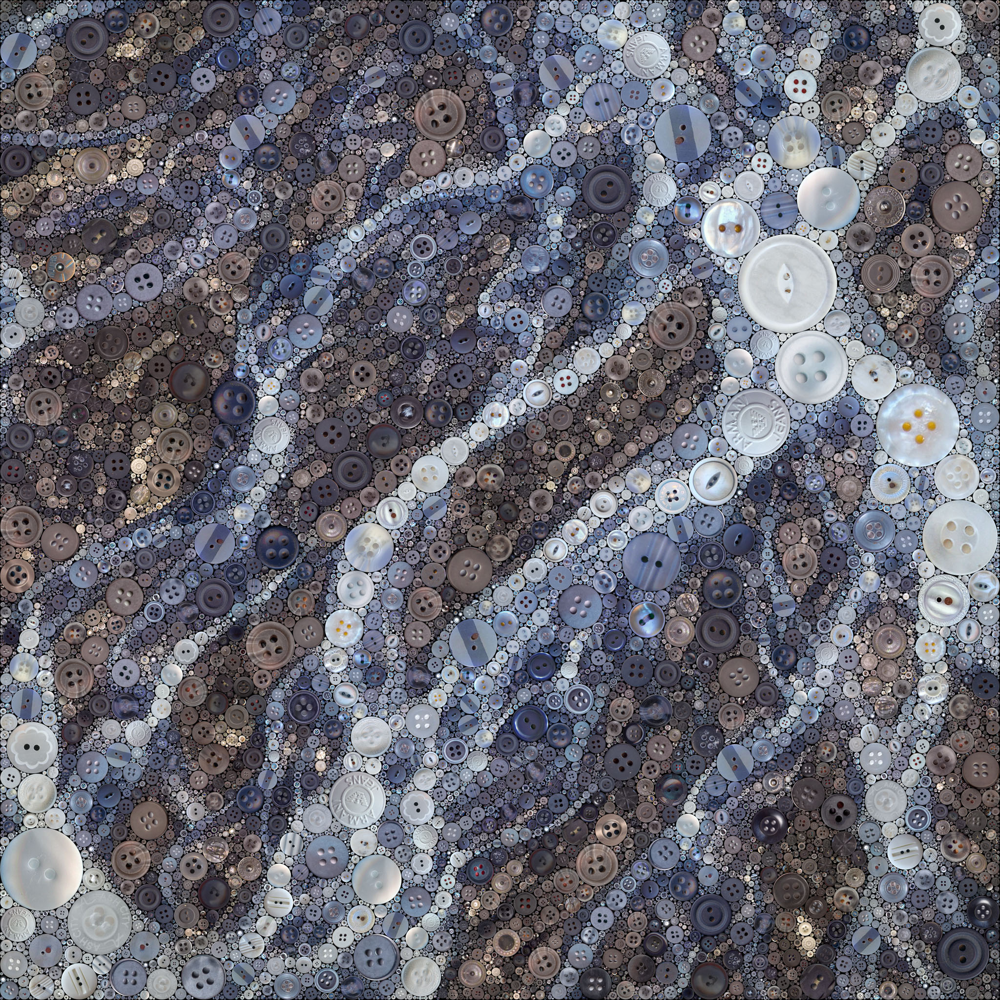

### De Tio Största, nr 3 - *Hilma af Klint*

  
  

### Girl with a Pearl Earring - *Johannes Vermeer*

  
  

### American Gothic - *Grant Wood*

  
  

### Braided Streams - *Katmai National Park and Preserve*

  
  

[Source Photo](https://www.flickr.com/photos/katmainps/43417091514)